# stockManagerV1
Project sample inventory control

# Este projeto está em desenolvimento

O projeto tem como objetivo realizar a gestão de estoque de uma loja de forma geral. Nesta primeira fase foi desenvolvido um simples gerenciameto.

## Back end

**nestjs**||
**prisma**||
**jwt**||
**docker**||
**mysql**||

## Front end

**reactjs**

## Telas

**Login**

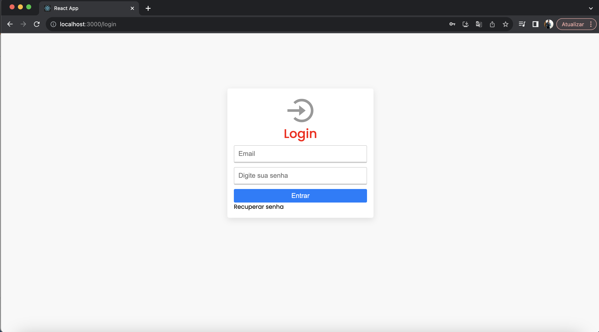

**RecuperarSenha**

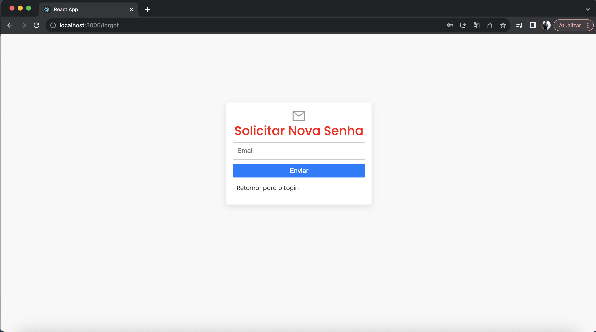

**Painel**

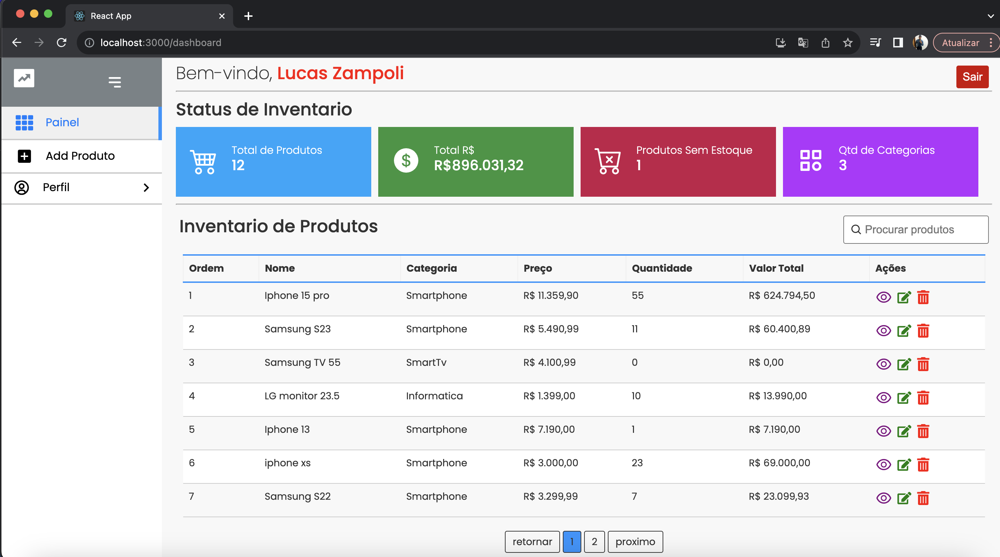

**AdicioarProduto**

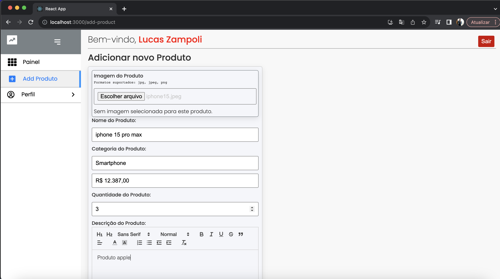

**DetalhesProduto**

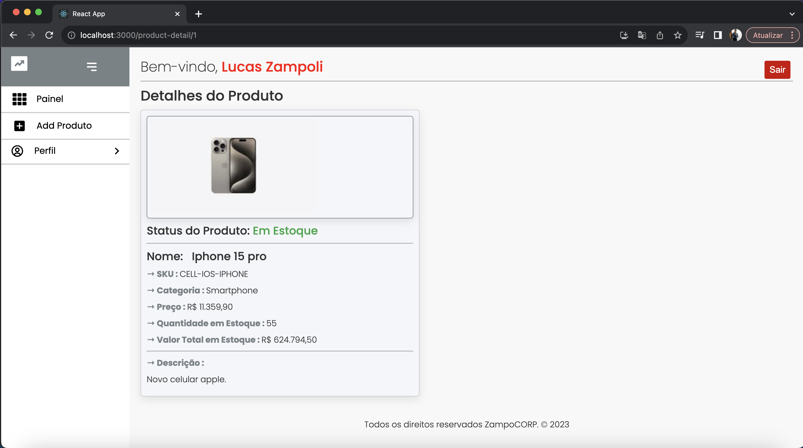

**EditarProduto**

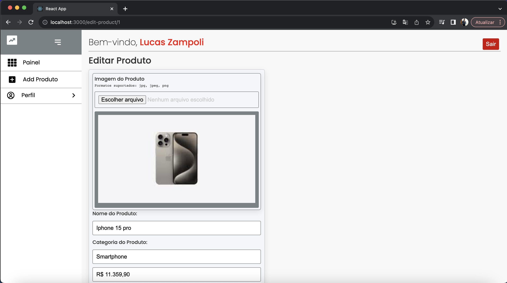

**Painel Usuarios**

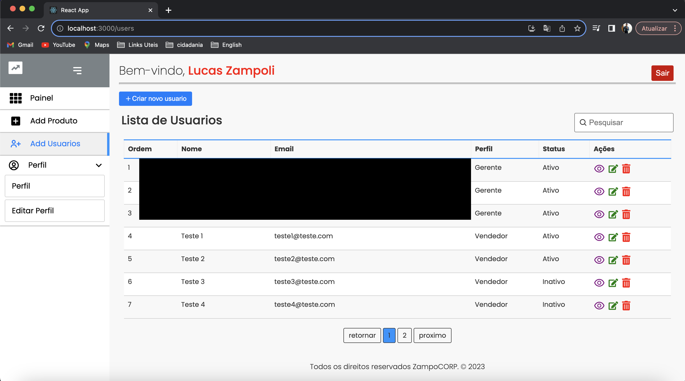

**AdicioarProduto**

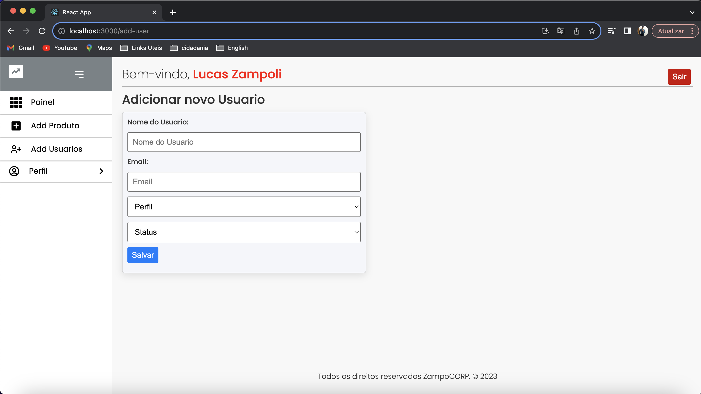

**DetalhesProduto**

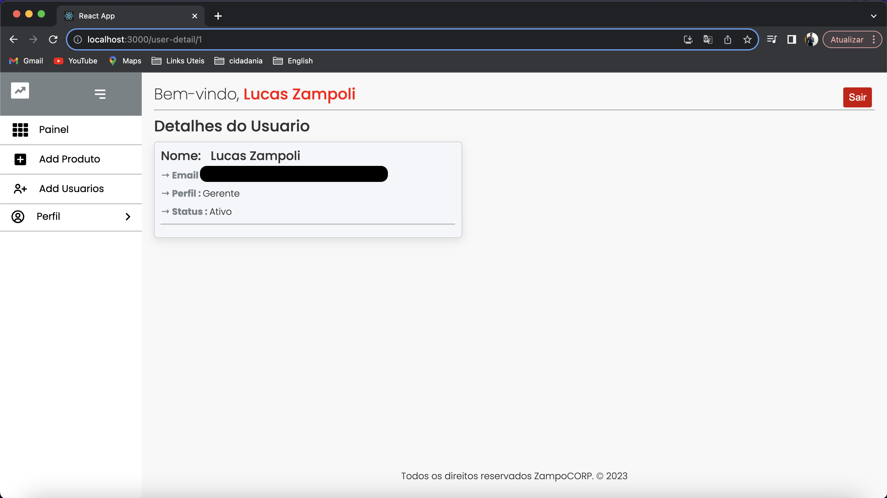

**EditarProduto**

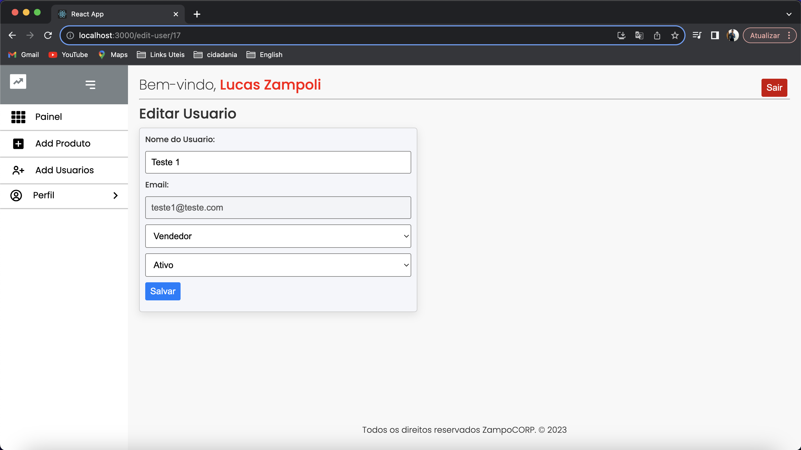

**EditarPerfil**

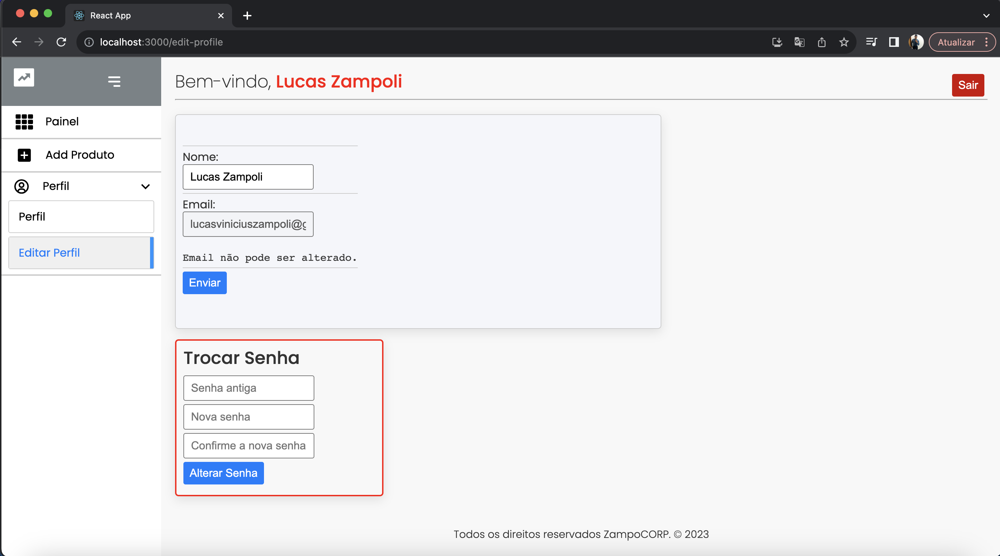

