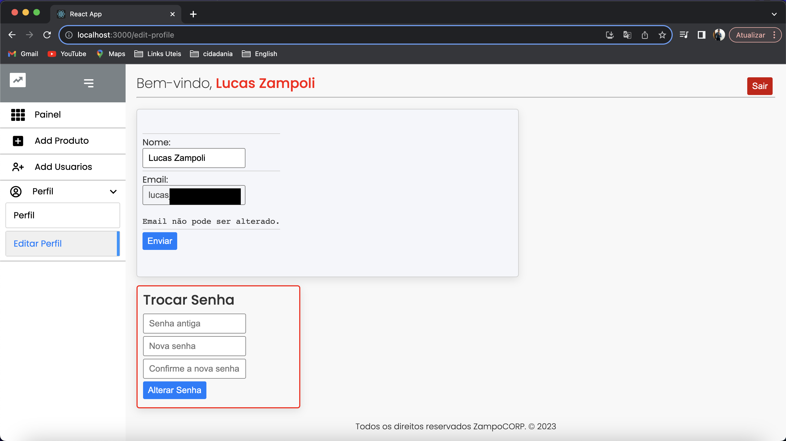

# stockManagerV1
Project sample inventory control

# Este projeto está em desenolvimento

O projeto tem como objetivo realizar a gestão de estoque de uma loja de forma geral. Nesta primeira fase foi desenvolvido um simples gerenciameto.

## Back end

**nestjs**||
**prisma**||
**jwt**||
**docker**||
**mysql**||

## Front end

**reactjs**

## Telas

**Login**

**Recuperar Senha**

**Painel Principal**

**Adicionar Produto**

**Detalhes Produto**

**Editar Produto**

**Painel Usuarios**

**Adicionar Usuario**

**Detalhes Usuario**

**Editar Usuario**

**Editar Perfil**

